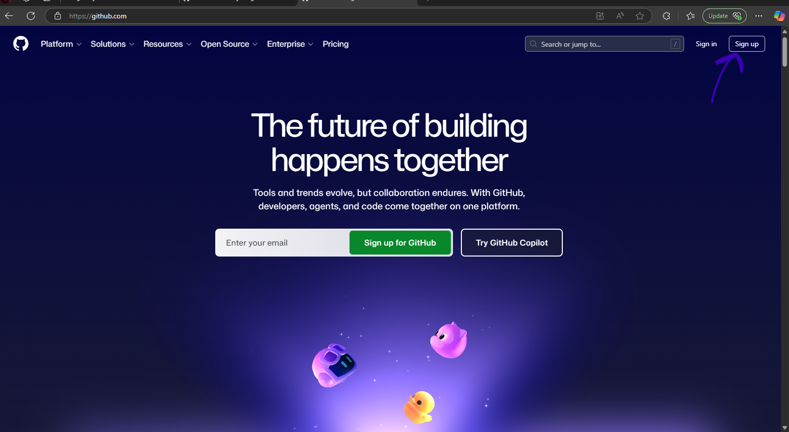
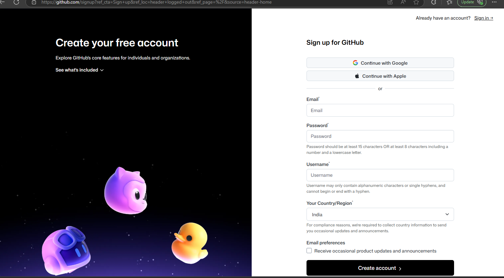
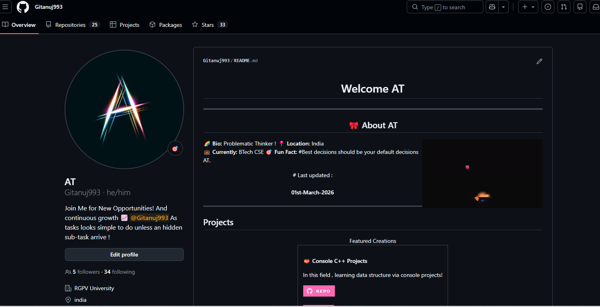
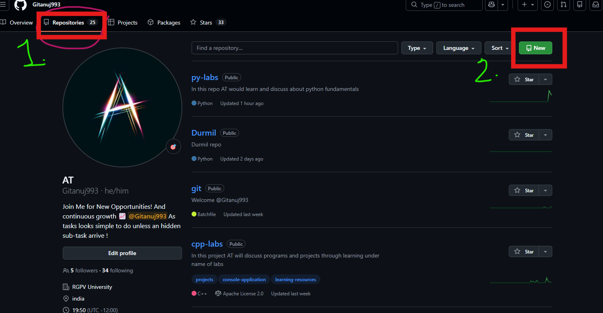

# Getting started with git and github

### First you have to create a account on github , gitlab or any other
> github is a software which provides online storage of work in the form of repositories in short repos

> git is a version control software which lets you traverse from old version and the latest version of your code . 

## /Creating a github account 
## Simply ask for chatGpt or follow the given instructions.

1. visit  `` www.github.com `` 
2. Press signup

3.  Enter you credentials , continue with email is recommended

4. Then you will see your profile

5. Create your first repo by clicking on repository

